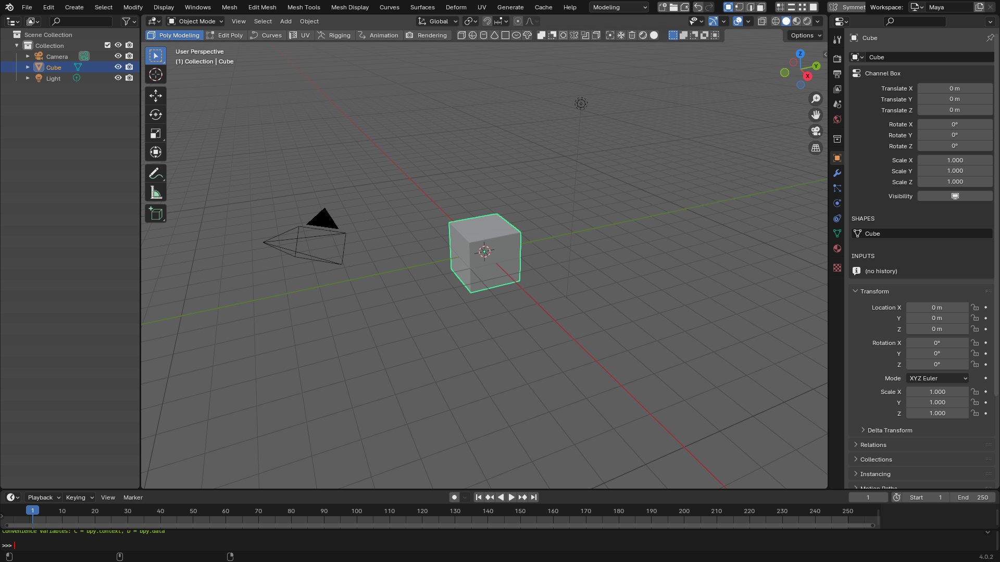
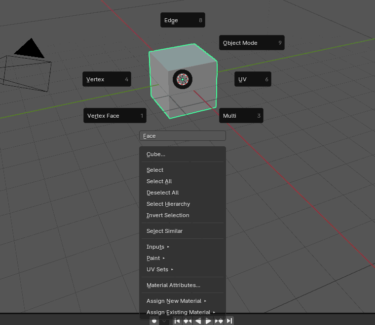
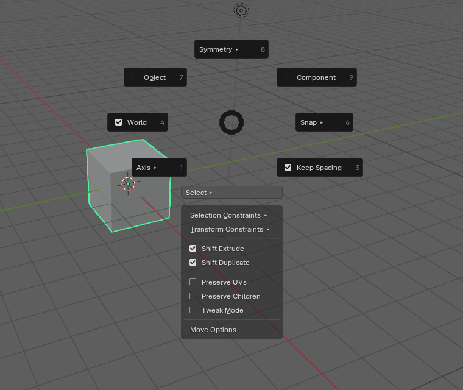

# BlanderToMaya: Maya Style UI for Blender

블렌더를 마야처럼 쓰게 해 주는 애드온이에요. 설치하면 마야식 화면 배치, 메뉴바, 키맵, 셸프, 마킹 메뉴, 채널 박스가 한 번에 세팅돼요.



> **무엇이 바뀌었는지 전체 정리 (원래 블렌더 → 마야처럼 바꾼 것, 불가능한 것):** [docs/CHANGES_KO.md](docs/CHANGES_KO.md)

## 다운로드 및 설치

1. 최신 버전 [`dist/maya_style_v0.9.0.zip`](dist/maya_style_v0.9.0.zip)을 다운로드합니다. 파일을 연 뒤 **Download raw file** 버튼을 누르면 돼요. **압축은 풀지 마세요.**
   - 예전 버전은 [`dist/`](dist/) 폴더에, 버전별 변경 내용은 [CHANGELOG.md](CHANGELOG.md)에 있어요.
2. 블렌더를 엽니다. **4.0 이상**을 지원해요.
3. `Edit → Preferences → Get Extensions` 화면에서 오른쪽 위 `⌄` 메뉴를 열고 **Install from Disk...**를 누른 뒤 zip을 선택합니다.
   (4.0, 4.1 또는 구버전 방식: `Add-ons` 탭 → **Install...** 또는 `⌄` → **Install from Disk...** → 목록에서 체크)
4. 설치되면 바로 `Maya` 워크스페이스로 바뀌고, 키맵이 **Industry Compatible**(마야식)로 바뀌어요.
5. 새 버전으로 업데이트할 때도 같은 방법으로 새 zip을 설치하면 이전 버전을 덮어써요.

## 기능

### 0. 마야 인터페이스
- **화면 배치**: 왼쪽 아웃라이너, 가운데 뷰포트(왼쪽에 툴박스), 오른쪽 채널 박스, 아래 타임라인
  - 오른쪽은 블렌더 속성 창이에요. Object 탭 맨 위에 채널 박스가 있고, 아래쪽에 Layer Editor가 있어요. 다른 탭은 마야의 Attribute Editor 역할이에요.
  - 원래 블렌더 화면은 위쪽 `Workspace:`에서 `Layout`을 고르면 돼요.
  - 화면이 망가지면 `Windows → Reset Maya Workspace`를 누르세요.
  - 워크스페이스는 .blend 파일마다 저장돼요. 그래서 새 파일이나 다른 사람 파일을 열면 `Maya` 워크스페이스를 자동으로 추가해요. 설정에서 끌 수 있어요.
- **메뉴바**: `File Edit Create Select Modify Display Windows` + 메뉴셋 메뉴 + `Help`
  - 메뉴셋 드롭다운이나 **F2~F6**으로 바꾸면 뒤쪽 메뉴가 바뀌어요.
    - **Modeling**: Mesh, Edit Mesh, Mesh Tools, Mesh Display, Curves, Surfaces, Deform, UV, Generate, Cache
    - **Rigging**: Skeleton, Skin, Deform, Constrain, Control, Cache
    - **Animation**: Key, Playback, Audio, Visualize, Deform, Constrain, Cache
    - **FX**: nParticles, Fluids, nCloth, nHair, Fields/Solvers, Effects, Cache
    - **Rendering**: Lighting/Shading, Texturing, Render, Toon, Stereo
  - 원래 블렌더 메뉴는 File / Edit / Help 맨 아래에 "Blender ... Menu"로 남겨 뒀어요.
  - **Space를 누르고 있으면 핫박스**가 떠요. 모든 메뉴와 뷰 전환(Top / Front / Side / Perspective)을 커서 근처에서 쓸 수 있어요.
- **상태줄**: 메뉴바 옆
  - 새 파일, 열기, 저장, 실행 취소, 다시 실행
  - 오브젝트, 버텍스, 엣지, 페이스 모드
  - 그리드, 커브, 점, 면 스냅 토글
  - Symmetry X, 렌더, IPR, 렌더 설정
- **마야 색상**: 회색 뷰포트, 선택한 오브젝트는 초록색. 블렌더 색으로 돌아가려면 설정에서 **Reset Blender Colors**를 누르세요.
- **셸프**: 마야처럼 탭으로 되어 있어요.

### 1. 마야식 단축키
설치하면 키맵이 한 번 자동으로 **Industry Compatible**로 바뀌고, 그 위에 마야 단축키를 덮어씌워요.

**화면 조작**
| 키 | 기능 |
|---|---|
| Alt + 좌클릭 드래그 | 회전 (Tumble) |
| Alt + 휠클릭 드래그 | 이동 (Track) |
| Alt + 우클릭 드래그 | 확대/축소 (Dolly) |
| F | 선택한 것을 화면 중앙에 (아무것도 선택 안 했으면 전체를 화면에) |
| A | 전체 오브젝트를 화면 중앙에 |
| Space | 4분할 뷰 ↔ 단일 뷰 (4분할일 때는 마우스를 올린 화면이 커지고, 각 화면은 자기 시점을 유지) |
| Ctrl + Space | 뷰포트 최대화 |

**기본 조작 및 편집**
| 키 | 기능 |
|---|---|
| Q / W / E / R | 선택 / 이동 / 회전 / 스케일 |
| Ctrl + Z / Ctrl + Y | 실행 취소 / 다시 실행 |
| G | 직전 명령 반복 |
| Ctrl + D | 복제 |
| Shift + P | 부모 해제 |
| Alt + Shift + D | 히스토리 삭제 (모디파이어 적용) |
| Alt + V | 애니메이션 재생 (Space를 4분할 뷰에 쓰기 때문에 마야처럼 Alt+V로 옮김) |

**디스플레이 / 셰이딩**
| 키 | 기능 |
|---|---|
| 4 | 와이어프레임 |
| 5 | 셰이드 (Solid) |
| 6 | 텍스처 (Material Preview) |
| 7 | 라이팅 (Rendered) |

**컴포넌트 / 스무스 프리뷰**
| 키 | 기능 |
|---|---|
| F8 | 오브젝트 ↔ 컴포넌트 모드 전환 |
| F9 / F10 / F11 | 버텍스 / 엣지 / 페이스 |
| 1 | 스무스 끄기 (원본 폴리곤) |
| 2 | 케이지 + 스무스 |
| 3 | 스무스 |

스무스 프리뷰는 선택한 메시에 `Smooth Preview`라는 Subdivision 모디파이어를 붙였다 뗐다 하는 방식이에요.

**스냅 (누르고 있는 동안만)**
| 키 | 기능 |
|---|---|
| X | 그리드 스냅 |
| V | 버텍스 스냅 |
| C | 커브(엣지) 스냅 |

키를 누른 채로 이동하면 스냅되고, 키를 떼면 원래 스냅 설정으로 돌아가요.

**숨기기 / 표시**
| 키 | 기능 |
|---|---|
| Ctrl + H | 선택한 것 숨기기 |
| Shift + H | 숨긴 것 다시 표시 |
| Alt + H | 선택한 것만 남기고 숨기기 (Isolate) |

원래 블렌더 키맵으로 돌리려면 애드온 설정에서 **Restore Blender Keymap**을 누르고 **Maya Hotkeys**를 끄세요.

### 2. 셸프 바 (뷰포트 상단)
왼쪽 드롭다운에서 셸프를 고르면 오른쪽 아이콘 줄이 바뀌어요.

| 셸프 | 내용 |
|---|---|
| Poly Modeling | 큐브, 구, 실린더 등 기본 도형 생성, Combine, Separate, Smooth, Mirror, Boolean, Center Pivot, Freeze, Delete History |
| Edit Poly | 버텍스/엣지/페이스 모드, Extrude, Bevel, Inset, Insert Edge Loop, Multi-Cut, Bridge, Fill Hole, Merge, Target Weld |
| Curves | 베지어/NURBS 커브, 원, 패스, 텍스트, NURBS 서피스 |
| UV | Unfold, Automatic, Cube/Cylinder/Sphere/Planar 투영, Cut/Sew |
| Rigging | 조인트, 로케이터, Parent, Bind Skin, IK, 각종 Constraint, 포즈/웨이트 페인트 모드 |
| Animation | Set Key, Delete Key, 재생과 키프레임 이동, Motion Trail, Bake |
| Rendering | 카메라, 라이트, 와이어프레임/셰이딩/텍스처/렌더 뷰, 렌더 |

아이콘에 마우스를 올리면 설명이 나와요. 글자를 같이 보고 싶으면 설정에서 **Show Button Labels**를 켜세요.

### 3. 우클릭 메뉴 (오브젝트 위에서 우클릭을 누르고 있기)
마야처럼 오브젝트 위에서 우클릭을 **누르고 있으면** 메뉴가 열려요. 원하는 항목 위에서 버튼을 떼면 실행돼요. 짧게 클릭하면 메뉴가 열린 채로 남아 있어요.

```
              [Edge]
                         [Object Mode]
 [Vertex]       ●          [UV ▸]
 [Vertex Face]             [Multi]
              [Face]
          ┌───────────────────────┐
          │ Cube...               │  ← 속성 보기 (Attribute Editor)
          │ Select / Select All   │
          │ Deselect All          │
          │ Select Hierarchy      │
          │ Invert Selection      │
          │ Select Similar        │
          │ Inputs ▸  Paint ▸     │
          │ UV Sets ▸             │
          │ Material Attributes...│
          │ Assign New Material ▸ │  ← Lambert / Blinn / Phong / Standard Surface
          │ Assign Existing ▸     │
          └───────────────────────┘
```
- **Vertex Face**는 버텍스와 페이스 선택을 함께 켜고, **Multi**는 버텍스, 엣지, 페이스 선택을 모두 켜요.
- 에딧 모드에서는 아래 목록이 Select Shell, Edge Loop, Edge Ring, Grow, Shrink 같은 컴포넌트용으로 바뀌어요. 이때 Assign Material은 선택한 페이스에만 적용돼요.
- 오브젝트가 선택되어 있으면 **빈 공간**에서 우클릭을 누르고 있어도 선택한 오브젝트의 메뉴가 열려요. 아무것도 선택하지 않았으면 원래 블렌더 메뉴가 열려요.



### 휠클릭 드래그로 축 고정 이동 (이동/회전/스케일 툴)
1. W/E/R로 이동, 회전, 스케일 툴을 고릅니다.
2. 기즈모에서 원하는 축(예: 빨간 X 화살표, 회전이면 링)을 **한 번 클릭**합니다. 드래그해도 돼요.
3. 이제 뷰포트 **아무 데서나 휠클릭 드래그**하면 그 축으로만 움직여요.
- 고른 축은 기즈모 위에 **노란색**으로 표시되고, 셸프 바 오른쪽에도 휠클릭 아이콘과 `X`처럼 표시돼요.
- **W / E / R을 한 번 더 누르면** 축 선택이 가운데(자유 이동)로 돌아가요.
- 기즈모 가운데(자유 이동)를 클릭하면 `Free`로 돌아가요. 평면 핸들을 클릭하면 `XY plane`처럼 평면 이동이 돼요.
- 축은 마지막으로 그 툴로 움직인 방향을 기억해요. 기즈모 대신 오브젝트를 직접 끌어서 움직였다면 `Free`로 바뀌어요.

### 툴 설정 메뉴 (Ctrl+Shift+우클릭)
마야처럼 Ctrl+Shift+우클릭을 하면 이동 툴 설정 메뉴가 열려요.



| 메뉴 | 블렌더에서 하는 일 |
|---|---|
| Object / World / Component | 기즈모 방향 Local / Global / Normal |
| Axis ▸ | 방향 전체 목록 (World, Object, Component, Parent, Gimbal, View, 3D 커서) |
| Symmetry ▸ | 메시 대칭 X / Y / Z, Topology |
| Snap ▸ | 그리드, 커브(엣지), 점, 면 스냅 |
| Keep Spacing | 켜면 스냅할 때 선택한 것들이 간격을 유지한 채 함께 움직여요. 끄면 버텍스가 하나씩 따로 면에 붙어요. |
| Select ▸ | 선택, 올가미, 페인트 선택, 트윅, 이동, 회전, 스케일 툴 |
| Selection Constraints ▸ | 엣지 루프, 엣지 링, 경계, 셸 선택 |
| Transform Constraints ▸ | 엣지 슬라이드, 버텍스 슬라이드, 면 위로 투영 |
| Shift Extrude / Shift Duplicate | Shift를 누른 채 기즈모 화살표를 드래그하면 익스트루드 / 복제하며 이동 |
| Preserve UVs | UV를 유지하면서 이동 (Correct Face Attributes) |
| Preserve Children | 부모만 움직이고 자식은 제자리 (Affect Only Parents) |
| Tweak Mode | 트윅 툴로 전환 |
| Move Options | 속성 창의 툴 설정 탭 열기 |

### Shift + 드래그 (마야와 같은 동작)
- **Shift + 기즈모 화살표(또는 링, 스케일 핸들) 좌클릭 드래그**
  - 컴포넌트 모드: 선택한 면이나 엣지를 **익스트루드**하면서 그 축으로 이동해요.
  - 오브젝트 모드: 오브젝트를 **복제**하면서 그 축으로 이동해요.
  - 툴 설정 메뉴(Ctrl+Shift+우클릭)의 Shift Extrude / Shift Duplicate로 끌 수 있어요.
- **Shift + 휠클릭 드래그**: 처음 드래그한 방향에 가까운 축으로 고정해서 움직여요.
- **선택**: Shift+클릭은 토글, Ctrl+클릭은 선택 해제, Ctrl+Shift+클릭은 추가예요. 박스 선택도 똑같이 동작해요.
- **뒤에 있는 것도 선택**: 박스나 올가미로 드래그하면 X-ray를 켜지 않아도 가려진 오브젝트와 뒤쪽 버텍스·엣지·페이스까지 선택돼요. 화면은 X-ray 없이 그대로예요 (드래그하는 동안에도 투명해지지 않아요). 클릭은 앞에 보이는 것만 골라요.

### 4. 마킹 메뉴 (Shift+우클릭)
- **오브젝트 모드**: 기본 도형 생성, 아래쪽에 Smooth, Combine, Center Pivot, Freeze, Delete History 같은 버튼 묶음
- **에딧 모드**: Extrude, Bevel, Insert Edge Loop, Multi-Cut, Target Weld, Inset, Edge Slide, 아래쪽에 Bridge, Fill, Merge 같은 버튼 묶음

### 5. 채널 박스 (N 패널 → Channel Box 탭)
- Translate, Rotate, Scale, Visibility를 마야처럼 한 줄씩 보여줘요.
- SHAPES(메시 이름)와 INPUTS(모디파이어 = 마야의 히스토리)도 함께 보여줘요.
- **Layer Editor**: 컬렉션 숨기기와 렌더 토글, 선택한 오브젝트로 새 레이어 만들기
- **World Space (Global)**: 채널 박스 아래에 월드 기준 Translate / Rotate / Scale이 있어요. 채널 박스 값은 부모 기준(Local)이고, 여기 값은 장면 기준이에요. 둘 다 직접 입력해서 바꿀 수 있어요.
- 컴포넌트 모드에서는 선택한 버텍스들의 중심 위치를 Local / World로 보여주고, 숫자를 입력해서 옮길 수 있어요.

### 6. 프로젝트 (File → Project Window / Set Project)
마야처럼 프로젝트 폴더를 만들고, 그 안의 경로가 자동으로 잡혀요.
- **Project Window...**: 프로젝트 이름과 위치를 넣고 OK(Accept)를 누르면 마야와 같은 폴더(scenes, assets, images, sourceimages, renderData, clips, sound, scripts, data, movies, Time Editor, autosave, sceneAssembly)와 `workspace.mel`을 만들고 그 프로젝트로 설정해요. 폴더 이름은 창에서 바꿀 수 있고, **New** 버튼은 기본값으로 다시 채워요.
- **Set Project...**: 이미 있는 프로젝트 폴더를 골라요. **마야에서 만든 프로젝트도 그대로 쓸 수 있어요** (`workspace.mel`을 읽어요). `workspace.mel`이 없으면 기본 내용으로 만들어요.
- **Recent Projects**: 최근 프로젝트 목록. File 메뉴 위쪽에 지금 프로젝트가 표시돼요.
- 프로젝트가 설정되면 자동으로:
  - Open Scene(Ctrl+O), 새 장면 Save(Ctrl+S), Save As(Ctrl+Shift+S) → `scenes` 폴더에서 시작
  - 텍스처 이미지 열기 → `sourceimages`, 사운드 → `sound`
  - 렌더 출력 → `images` (렌더 경로를 직접 바꾼 장면은 그대로 둬요)
  - 자동 저장 → `autosave`
- 프로젝트 안에 있는 .blend 파일을 열면 그 프로젝트로 자동 설정돼요.

## 설정
`Edit → Preferences → Add-ons → Maya Style UI`를 펼치면 다음을 바꿀 수 있어요.
- 키맵 적용 및 복원 버튼
- 마야 상단 바 켜기/끄기, 채널 박스를 속성 창에 표시
- Maya 워크스페이스 다시 만들기, 마야 색상 적용 및 블렌더 색상 복원
- 셸프 위치: Tool Header / Header / 숨김, 셸프 모양: 탭 / 드롭다운
- 우클릭 메뉴, 마킹 메뉴, 툴 설정 메뉴, 휠클릭 축 고정, 마야 단축키 켜기/끄기

## 설치할 때 "Permission denied" / "lock could not be created" 오류가 날 때
`C:\Program Files\Blender Foundation\Blender 5.0\portable\...` 같은 경로가 오류에 나오면, 블렌더가 설정과 확장을
쓰기 금지된 `Program Files` 안의 `portable` 폴더에 저장하려다 막힌 거예요. 애드온 문제가 아니라 블렌더 설치 위치 문제예요.

1. 블렌더를 끄고 `C:\Program Files\Blender Foundation\Blender 5.0` 을 엽니다.
2. `portable` 폴더 이름을 `portable_old` 로 바꿉니다 (관리자 권한 확인 → 계속).
3. 블렌더를 다시 켜면 설정이 `%APPDATA%\Blender Foundation\Blender\5.0` 에 저장돼요. 그다음 zip을 다시 설치하세요.

포터블 모드를 계속 쓰고 싶다면 블렌더 폴더를 `C:\Blender\` 처럼 쓰기 가능한 곳으로 옮겨서 실행해도 돼요.

## 셸프가 안 보일 때
뷰포트 헤더에서 `View → Tool Settings`를 체크하거나, 애드온 설정에서 **Show Shelf in All Viewports**를 누르세요.

## 직접 빌드
```
python build_zip.py   # dist/maya_style_v<버전>.zip 생성
```
버전을 올릴 때는 `maya_style/blender_manifest.toml`의 `version`과 `maya_style/__init__.py`의 `bl_info["version"]`을 같이 바꾸고 빌드하세요. 예전 zip은 지우지 않아요.
