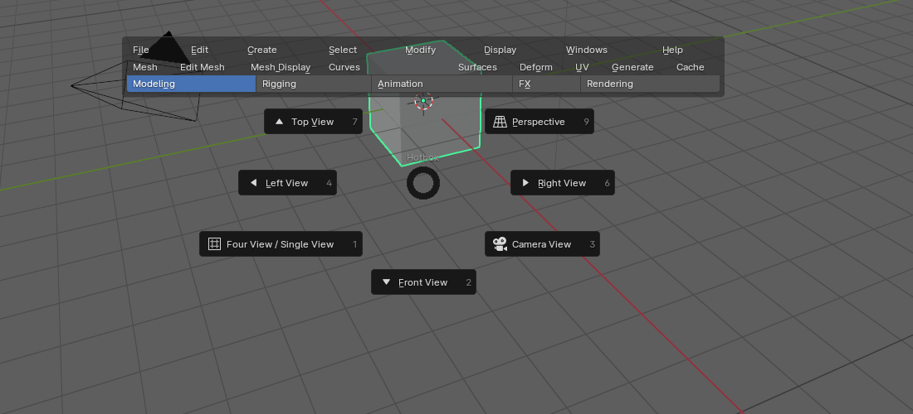
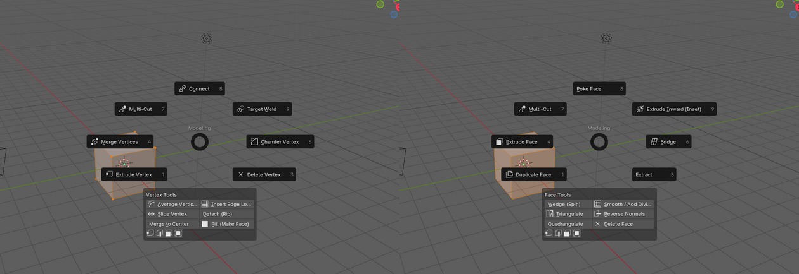

# 블렌더 → 마야: 바꾼 것 정리

이 애드온(Maya Style UI)을 설치하면 블렌더가 어떻게 바뀌는지 정리한 문서예요.

- "원래 블렌더에서는 이랬는데 → 마야처럼 이렇게 바꿨습니다" 순서로 적었어요.
- 블렌더 구조상 **불가능하거나 다르게 대체한 것**은 맨 아래에 따로 모았어요.

> 기준 버전: Maya Style UI v0.8.4 / 블렌더 4.0 ~ 5.2

---

## 1. 화면 구성

| 원래 블렌더 | 마야처럼 바꾼 것 |
|---|---|
| `Layout` 워크스페이스: 아웃라이너와 속성 창이 오른쪽에 위아래로 붙어 있음 | `Maya` 워크스페이스를 새로 만들고 자동으로 전환해요. **왼쪽에 아웃라이너, 가운데에 뷰포트, 오른쪽에 채널 박스, 아래에 타임라인과 커맨드 라인**이 있어요. |
| 오른쪽 속성 창 Object 탭 맨 위가 Transform 패널 | 맨 위에 **Channel Box**가 들어가요. Translate X/Y/Z, Rotate, Scale, Visibility, SHAPES, INPUTS(히스토리)와 사용자 속성을 보여주고, 아래쪽에 **Layer Editor**가 있어요. |
| 월드 좌표는 따로 볼 곳이 없음 (부모가 있으면 Transform 패널은 부모 기준 값만 보여줌) | 채널 박스 아래에 **World Space (Global)** 섹션을 넣었어요. 월드 기준 위치·회전·스케일을 보고 직접 입력할 수 있어요. 컴포넌트 모드에서는 선택한 버텍스 중심의 Local / World 위치도 보여줘요. |
| 사용자 속성(Custom Property)은 속성 창 맨 아래에 숨어 있음 | Modify → Add Attribute로 만들면 마야처럼 채널 박스에 바로 나와요. |
| 타임라인 높이가 크고 채널 목록이 같이 보임 | 마야 타임 슬라이더처럼 얇게 바꾸고 채널 목록을 숨겼어요. |
| 커맨드 라인 없음 | 타임라인 아래에 한 줄짜리 **커맨드 라인**(파이썬)을 넣었어요. MEL 대신 파이썬 명령을 입력해요. |
| 사이드바(N)에 Item / Tool / View 탭만 있음 | **Channel Box** 탭과 **Modeling Toolkit** 탭을 추가했어요. Modeling Toolkit에는 선택 모드, 소프트 선택, 대칭, 컴포넌트 툴이 들어 있어요. |
| 블렌더 기본 테마: 어두운 뷰포트, 주황색 선택 표시 | 마야 색상: 회색 뷰포트, **선택한 오브젝트는 초록색**, 다른 선택은 흰색이에요. (설정에서 Reset Blender Colors로 되돌릴 수 있어요.) |
| 새 파일이나 다른 사람 파일에는 내 레이아웃이 없음 | `Maya` 워크스페이스가 없는 파일을 열면 자동으로 추가해요. |

## 2. 맨 위 메뉴바와 상태줄

| 원래 블렌더 | 마야처럼 바꾼 것 |
|---|---|
| 메뉴: File, Edit, Render, Window, Help | 마야 메뉴바: **File, Edit, Create, Select, Modify, Display, Windows + 메뉴셋 메뉴 + Help** |
| 메뉴셋 개념 없음 | **메뉴셋 드롭다운**(F2~F6)을 넣었어요. 고르는 메뉴셋에 따라 메뉴가 바뀌어요. |
| 가운데에 워크스페이스 탭(Layout, Modeling, Sculpting...) | 그 자리에 마야 **상태줄**이 들어가요. 새 파일/열기/저장, 실행 취소/다시 실행, 오브젝트/버텍스/엣지/페이스 선택 모드, 그리드/커브/점/면 스냅, Symmetry, 렌더/IPR/렌더 설정 버튼이 있어요. |
| 오른쪽 위에 Scene / View Layer 선택 | 마야처럼 **Workspace:** 드롭다운이 있어요. |
| 블렌더 File·Edit 메뉴 | 마야 File·Edit 메뉴로 바꿨어요. 원래 블렌더 메뉴는 각 메뉴 맨 아래 "Blender File Menu / Blender Edit Menu"에 남겨 뒀어요. |
| 메뉴 항목은 해당 창 안에서만 동작 | 위쪽 메뉴에서 고른 명령도 **3D 뷰포트에서 실행**되게 했어요. |

메뉴셋별 메뉴는 다음과 같아요.

| 메뉴셋 (단축키) | 메뉴 |
|---|---|
| Modeling (F2) | Mesh, Edit Mesh, Mesh Tools, Mesh Display, Curves, Surfaces, Deform, UV, Generate, Cache |
| Rigging (F3) | Skeleton, Skin, Deform, Constrain, Control, Cache |
| Animation (F4) | Key, Playback, Audio, Visualize, Deform, Constrain, Cache |
| FX (F5) | nParticles, Fluids, nCloth, nHair, Fields/Solvers, Effects, Cache |
| Rendering (F6) | Lighting/Shading, Texturing, Render, Toon, Stereo |

### 메뉴 항목이 블렌더에서 하는 일 (주요 항목)

마야 이름 그대로 메뉴에 넣고, 블렌더 기능 이름은 괄호에 적었어요.

| 메뉴 | 마야 항목 → 블렌더 동작 |
|---|---|
| File | New/Open/Save Scene, **Increment and Save**, Archive(리소스 패킹), Optimize Scene Size(사용하지 않는 데이터 삭제), Import / Export All / **Export Selection(FBX)**, Create Reference(링크), Recent Files, Exit |
| Edit | Undo/Redo/Repeat Last, Recent Commands, Cut/Copy/Paste, **Delete by Type**(History, Channels, Constraints, Motion Paths, Rigid Bodies, Attributes), **Delete All by Type**(Cameras, Lights, Curves, Joints...), Duplicate / Duplicate Special(인스턴스) / **Duplicate with Transform**, **Group / Ungroup**, Parent / Unparent |
| Create | NURBS Primitives, Polygon Primitives(Pyramid, Prism 포함), Lights, Cameras, Curve Tools, Type, Locator, Empty Group, Joint, Measure Tools |
| Select | All, All by Type, Hierarchy, Inverse, Similar, Grow/Shrink, Shell, Edge Loop/Ring, Border Edge, **Convert Selection**(To Vertices/Edges/Faces/UVs/Vertex Faces/Shell/Border/Loop/Ring/Contained) |
| Modify | **Freeze**(값만 0/0/1, 피벗은 제자리 — 블렌더 Apply는 피벗을 월드 중심으로 옮겨서 따로 구현), Reset Transformations(마지막 Freeze 위치로), **Match Transformations**, Center Pivot, Edit Pivot, Snap Align, **Add Attribute**, Replace Objects, Search and Replace Names(일괄 이름 변경), Convert, Combine, Delete History |
| Display | Grid, Heads Up Display, UI Elements, Hide/Show/Isolate, Wireframe Color, Object Display(Template, Bounding Box, X-Ray, Local Axes), Polygons 표시 옵션, 셰이딩 4~7, 스무스 1~3, 배경색 바꾸기 |
| Windows | Outliner, Attribute Editor, Spreadsheet(Component Editor), Content Browser(에셋 브라우저), UV Editor, Node Editor, 애니메이션 에디터(Graph, Dope Sheet, NLA, Drivers, Shape), 렌더링 에디터(Hypershade, Render View, Render Settings), Script Editor, Hotkey Editor, Playblast |
| Mesh | **Booleans**(Union/Difference/Intersection, 실제로 합쳐짐), Combine, Separate, Conform, Fill Hole, Reduce, Remesh, **Retopologize**(QuadriFlow), Smooth, Mirror, Triangulate, Quadrangulate, Clean Up, Transfer Attributes |
| Edit Mesh | Add Divisions, Bevel, Bridge, **Circularize**, Collapse, Connect, Detach, Extrude, Merge, Flip, Symmetrize, Average Vertices, **Chamfer Vertex**, Delete Edge/Vertex, Spin Edge, Duplicate, Extract, Poke, Wedge, Slide Edge, Offset Edge Loop, **Target Weld** |
| Mesh Tools | Append to Polygon, Connect, Crease, Create Polygon, Insert Edge Loop, Make Hole, Multi-Cut, **Quad Draw**, Slide Edge, Target Weld |
| Mesh Display | Conform/Reverse/Average Normals, Set to Face, Soften/Harden Edge, Apply Color, 표시 토글 |
| Curves / Surfaces | Reverse, Insert Knot, Open/Close, Rebuild, Attach/Detach, **Loft**, **Planar**, **Revolve**, **Extrude(경로를 따라)** |
| Deform | Blend Shape(셰이프 키), **Cluster**(훅), Curve Warp, Delta Mush, **Lattice**, Wrap, ShrinkWrap, Texture Deformer, Soft Mod, Sculpt, **Nonlinear**(Bend/Flare/Sine/Squash/Twist/Wave), Jiggle(소프트 바디), Paint Weights |
| UV | UV Editor, Automatic, Planar/Camera, Cube, Cylindrical, Spherical, Contour Stretch, Unfold, Layout, Normalize, Cut, Sew |
| Generate / Cache | XGen(헤어 커브), 파티클, Instancer(Array), Alembic/USD 내보내기·불러오기, 시뮬레이션 캐시, 애니메이션 베이크 |
| Skeleton / Skin | Create/Insert/Mirror/Orient Joints, **IK Handle / IK Spline**, **Quick Rig**(Rigify), Bind/Unbind Skin, Paint/Mirror/Copy/Smooth/Normalize/Prune Weights |
| Constrain / Control | Parent, Point, Orient, Scale, Aim, **Pole Vector**, Geometry, Normal, Tangent, Point on Poly, 컨트롤 커브(원, 큐브, 구, 화살표) |
| Key / Playback / Audio / Visualize | Set Key / Key Translate·Rotate·Scale, Delete Keys, Graph Editor, **Set Driven Key**(드라이버), Auto Key, 재생, 키·프레임 이동, Range Slider, **Import Audio**, Motion Trail, Playblast |
| FX | 파티클, 연기·불·액체, 천(nCloth), 충돌체, 헤어, 필드(Air, Drag, Newton, Turbulence, Vortex...), 캐시 굽기, Shatter |
| Rendering | 머티리얼 지정(Lambert/Blinn/Phong/Standard Surface), 조명, Hypershade, 3D 페인트, Render Frame/Sequence, IPR, Render Settings, **Toon 외곽선**(Freestyle, Line Art), Stereo |

## 3. 단축키

설치하면 키맵이 블렌더 기본에서 **Industry Compatible**(마야와 비슷한 블렌더 내장 키맵)로 바뀌고, 그 위에 마야 단축키를 덮어씌워요.

| 키 | 원래 블렌더 (기본 키맵) | 마야처럼 바꾼 것 |
|---|---|---|
| Alt + 좌/휠/우 드래그 | 휠 드래그 회전, Shift+휠 이동, 휠 스크롤 줌 | 마야처럼 회전 / 이동 / 줌 |
| Q / W / E / R | 툴 선택 없음 (W는 선택 툴 순환, R은 회전) | 선택 / 이동 / 회전 / 스케일 툴 |
| F / A | F: 면 채우기, A: 전체 선택 | 선택 프레이밍 / 전체 프레이밍 |
| Shift+F / Shift+A | Shift+F: 없음, Shift+A: 추가 메뉴 | 모든 뷰에서 프레이밍 |
| Space | 애니메이션 재생 | **짧게 누르면 4분할 ↔ 단일 뷰** (4분할에서는 마우스를 올린 화면이 커지고, 각 화면은 자기 시점을 유지), **누르고 있으면 핫박스** (재생은 Alt+V) |
| Ctrl+Space | 영역 최대화 | 뷰포트 최대화 |
| Ctrl+Z / Ctrl+Y, Z / Shift+Z | 다시 실행은 Ctrl+Shift+Z, Z는 셰이딩 메뉴 | 실행 취소 / 다시 실행 (Z, Shift+Z도 마야처럼) |
| G | 이동 | 마지막 명령 반복 |
| Ctrl+D / Shift+D / Ctrl+Shift+D | Shift+D: 복제 | 복제 / **Duplicate with Transform** / 인스턴스 복제 |
| Ctrl+G / P / Shift+P | Ctrl+G: 버텍스 그룹·컬렉션, P: 분리(에딧 모드) | **그룹** / 부모 지정 / 부모 해제 |
| Alt+Shift+D | 없음 | 히스토리 삭제 |
| 4 / 5 / 6 / 7 | 없음 (넘패드 4~7은 뷰 회전) | 와이어프레임 / 셰이드 / 텍스처 / 라이팅 |
| 1 / 2 / 3 | 버텍스 / 엣지 / 페이스 (에딧 모드) | 스무스 프리뷰 끄기 / 케이지+스무스 / 스무스 |
| F8 / F9 / F10 / F11 | F9: 마지막 작업 조정, F11: 렌더 창 보기 | 오브젝트↔컴포넌트 / 버텍스 / 엣지 / 페이스 |
| Ctrl+F9 / F10 / F11 | 없음 | 선택을 버텍스 / 엣지 / 페이스로 변환 |
| F2 ~ F6 | 이름 바꾸기 등 | 메뉴셋 Modeling / Rigging / Animation / FX / Rendering |
| X / C / V (누르고 있기) | X: 삭제, C: 원형 선택, V: 찢기 | 그리드 / 커브(엣지) / 점 스냅 |
| B / B + 휠클릭 드래그 | B: 박스 선택 | **소프트 선택 켜기·끄기 / 반경 조절** |
| D (누르고 있기) / Insert | D+드래그: 주석 그리기 | **피벗 편집** (오브젝트는 그대로, 피벗만 이동) |
| Ctrl+H / Shift+H / Alt+H | H: 숨기기, Alt+H: 보이기 | 숨기기 / 다시 표시 / Isolate (나머지 숨기기) |
| Ctrl+E / Ctrl+B | 엣지 메뉴 / 베벨 | 익스트루드 / 베벨 |
| > / < (Shift+. / Shift+,) | 없음 | 선택 늘리기 / 줄이기 |
| Ctrl+Shift+I | 없음 | 선택 반전 |
| , / . , Alt+, / Alt+. | 방향·피벗 메뉴 | 이전·다음 키 / 이전·다음 프레임 |
| ↑ ↓ ← → | 키프레임 / 프레임 이동 | 오브젝트 계층 **픽워크** (부모 / 자식 / 형제) |
| Ctrl+A | 적용(Apply) 메뉴 | Attribute Editor 열기·닫기 |
| Alt+B | 클리핑 영역 | 뷰포트 배경색 바꾸기 |
| Ctrl+Alt + 좌클릭 드래그 | 없음 | 영역 줌 |
| S / Shift+W / Shift+E / Shift+R | S: 스케일 | 키 설정 / 이동·회전·스케일 키 |

## 4. 마킹 메뉴와 핫박스

| 조작 | 원래 블렌더 | 마야처럼 바꾼 것 |
|---|---|---|
| 오브젝트 위에서 우클릭을 누르고 있기 | 우클릭: 오브젝트 선택 또는 컨텍스트 메뉴 | 마야 컴포넌트 마킹 메뉴: Vertex / Edge / Face / Object Mode / UV / Vertex Face / Multi, 그리고 오브젝트 메뉴(Select, Inputs, Paint, UV Sets, 머티리얼 지정...) |
| 빈 공간에서 우클릭 (선택한 오브젝트가 있을 때) | 컨텍스트 메뉴 | 선택한 오브젝트의 마킹 메뉴 |
| Shift+우클릭 | 3D 커서 놓기 | 오브젝트 모드에서는 생성 메뉴, 컴포넌트 모드에서는 **버텍스 / 엣지 / 페이스마다 다른 도구 메뉴** |
| Ctrl+우클릭 | 없음 | **선택 변환 메뉴** (To Vertices / Edges / Faces / UVs / Loop / Ring / Shell / Border) |
| Ctrl+Shift+우클릭 | 없음 | **툴 설정 메뉴** (Object / World / Component 방향, Axis, Symmetry, Snap, Keep Spacing, Shift Extrude, Preserve UVs...) |
| Space 누르고 있기 | 없음 | **핫박스**: 모든 메뉴와 메뉴셋 선택, Top / Front / Side / Perspective / Camera 뷰 전환 |

## 5. 이동 / 회전 / 스케일

| 원래 블렌더 | 마야처럼 바꾼 것 |
|---|---|
| 기즈모 축은 드래그해야만 동작하고, 클릭만 하면 아무 일도 없음 | 기즈모 축을 **클릭하면 그 축이 선택되고 노란색으로 표시돼요**. 셸프 바 오른쪽에도 휠클릭 아이콘과 `X`처럼 표시돼요. |
| Q / W / E / R을 다시 눌러도 변화 없음 | 같은 툴 키를 **한 번 더 누르면** 축 선택이 가운데(자유 이동)로 돌아가요. |
| 휠클릭 드래그는 자유 이동 | **선택한 축으로만** 이동, 회전, 스케일해요. |
| Shift+드래그 복제나 익스트루드 없음 | **Shift + 기즈모 화살표 드래그**로 익스트루드(컴포넌트 모드)나 복제(오브젝트 모드)를 하면서 그 축으로 이동해요. |
| Shift + 휠클릭 드래그 없음 | 마야처럼 **처음 드래그한 방향의 축으로 고정**해서 움직여요. |
| 선택: Ctrl+클릭은 일반 선택, 박스 선택은 Shift = 추가 / Ctrl+Shift = 교집합 (Industry Compatible) | 마야처럼 **Shift = 토글, Ctrl = 선택 해제, Ctrl+Shift = 추가**. 박스 선택도 같아요. |
| 박스 / 올가미 선택은 X-ray를 켜야만 뒤에 가려진 오브젝트·버텍스·엣지를 잡음 | X-ray를 켜지 않아도 **뒤에 있는 것까지 선택**돼요. X-ray는 드래그하는 동안에도 켜지지 않고 화면은 솔리드 그대로예요. 클릭 선택은 앞에 보이는 것만 골라요 (마야와 같음). |
| 솔리드 화면에서 와이어를 같이 보려면 Overlays 메뉴 안의 Wireframe을 찾아 켜야 함 | 뷰포트 헤더 오른쪽 끝(셰이딩 버튼 옆)의 **Wireframe on Shaded 버튼**으로 바로 켜고 꺼요. 투명해지지 않고 면 위에 엣지만 그려져요. |
| 소프트 선택 이름은 Proportional Editing (O) | B로 켜고 끄고, B + 휠클릭 드래그로 반경을 조절해요. |

## 6. 셸프

> 뷰포트가 좁아서 셸프 탭이 다 안 들어가면 탭이 자동으로 드롭다운 하나로 바뀌어요. 그래서 오른쪽의 Orientation, 대칭(X Y Z), Options가 잘리지 않아요.

| 원래 블렌더 | 마야처럼 바꾼 것 |
|---|---|
| 셸프 없음 (툴바와 메뉴만 있음) | 뷰포트 위에 **셸프 탭**(Poly Modeling, Edit Poly, Curves, UV, Rigging, Animation, Rendering)과 아이콘 버튼 줄이 있어요. |

---

## 7. 불가능하거나 다르게 대체한 것

블렌더에 그런 기능이 아예 없거나 구조가 달라서, 똑같이 만들 수 없었던 것들이에요.

### 아예 불가능

| 마야 기능 | 이유 |
|---|---|
| MEL 스크립트, .ma / .mb 파일 직접 열기 | 블렌더는 MEL을 실행할 수 없고 마야 파일 형식을 읽지 못해요. FBX, Alembic, USD로 주고받아야 해요. |
| 3D 뷰에서 UV 선택 (F12, Ctrl+F12) | 블렌더는 3D 뷰에서 UV를 선택할 수 없어요. UV는 UV 에디터에서만 다뤄요. (To UVs를 고르면 UV 에디터가 열려요.) |
| 뷰 실행 취소 / 다시 실행 ( [ , ] ) | 블렌더에는 카메라 이동 기록이 없어요. |
| 마야식 컨스트럭션 히스토리 (노드 그래프) | 블렌더 히스토리는 모디파이어 쌓기 방식이에요. INPUTS = 모디파이어, Delete History = 모디파이어 적용으로 대체했어요. |
| Paint Effects, Bifrost, MASH, XGen 원본 | 블렌더에 없는 시스템이에요. 메뉴에서는 지오메트리 노드, 헤어 커브, Array로 연결해 뒀어요. |
| Arnold 렌더러 | 블렌더는 Cycles / EEVEE를 써요. |
| 프로젝트 창 / Set Project | 블렌더에는 프로젝트 폴더 개념이 없어요. 파일 기준 상대 경로를 써요. |
| Character Set, Quick Select Set (완전한 형태) | 대신 버텍스 그룹으로 선택 세트를 만들 수 있어요. |
| Tension, Wrinkle 디포머, Hammer Weights, Paint Reduce/Transfer Weights | 블렌더에 해당 기능이 없어요. |
| 메쉬 고스팅 (Ghost Selected) | 블렌더 어니언 스킨은 그리스 펜슬에만 있어요. Motion Trail로 대체해요. |
| 오른쪽 패널에서 블렌더 Transform 패널 숨기기 | 블렌더 기본 패널이라 숨길 수 없어요. 접어두면 그 상태가 유지돼요. |
| W / E / R을 누르고 좌클릭하는 툴 옵션 마킹 메뉴 | Ctrl+Shift+우클릭 툴 설정 메뉴로 대체했어요. |

### 비슷하게 대체한 것

| 마야 | 블렌더에서 대신 하는 것 |
|---|---|
| Attribute Editor | 속성 창 (Ctrl+A로 Object ↔ Modifier 탭 전환) |
| Hypershade | Shader Editor (노드 방식) |
| Display Layer / Layer Editor | Collection (보이기 / 렌더 토글) |
| Trax / Time Editor | NLA 에디터 |
| Set Driven Key / Expression | 드라이버 (Drivers 에디터) |
| Range Slider | Preview Range (Playback 메뉴) |
| Target Weld (드래그 방식) | 버텍스를 고른 뒤 대상 버텍스를 Shift+클릭하고 실행 (Merge at Last) |
| Make Live + Quad Draw | Poly Build 툴 + 면 투영 스냅 |
| Loft | 커브를 메쉬로 바꾼 뒤 Bridge로 연결 |
| Jiggle 디포머 | 소프트 바디 |
| Cluster | Hook |
| Edit Edge Flow, Contour Stretch | Average Vertices(Relax), Follow Active Quads |
| nCloth / nParticles / Fluids / nHair | 블렌더 Cloth, Particles, Mantaflow(연기·불·액체), Hair Curves |
| Light Editor | 아웃라이너 + 속성 창 |
| Pick-walk (컴포넌트) | 오브젝트 계층만 지원 (컴포넌트는 ↑↓가 선택 늘리기/줄이기) |
| 메뉴에서 모달 툴 실행 | 메뉴를 클릭한 위치에서 시작해요 (블렌더 메뉴와 같은 방식) |
| Alembic / USD (리눅스 배포판 블렌더 일부) | 공식 블렌더에는 있고, 일부 리눅스 패키지에는 빠져 있어서 메뉴에 "(not available)"로 표시돼요. |

---

## 원래 블렌더로 돌아가기

- **화면**: 오른쪽 위 `Workspace:`에서 `Layout`을 고르세요.
- **키맵**: `Edit → Preferences → Add-ons → Maya Style UI`에서 **Restore Blender Keymap**을 누르세요.
- **기능 하나씩 끄기**: 같은 설정 화면에서 메뉴바, 우클릭 메뉴, 마킹 메뉴, 툴 설정 메뉴, 휠클릭 축 고정, 마야 단축키, 커맨드 라인을 각각 끌 수 있어요.
- **색상**: Reset Blender Colors를 누르세요.
- **완전히 원래대로**: 애드온을 끄면(체크 해제) 메뉴바와 단축키가 모두 원래대로 돌아가요.
